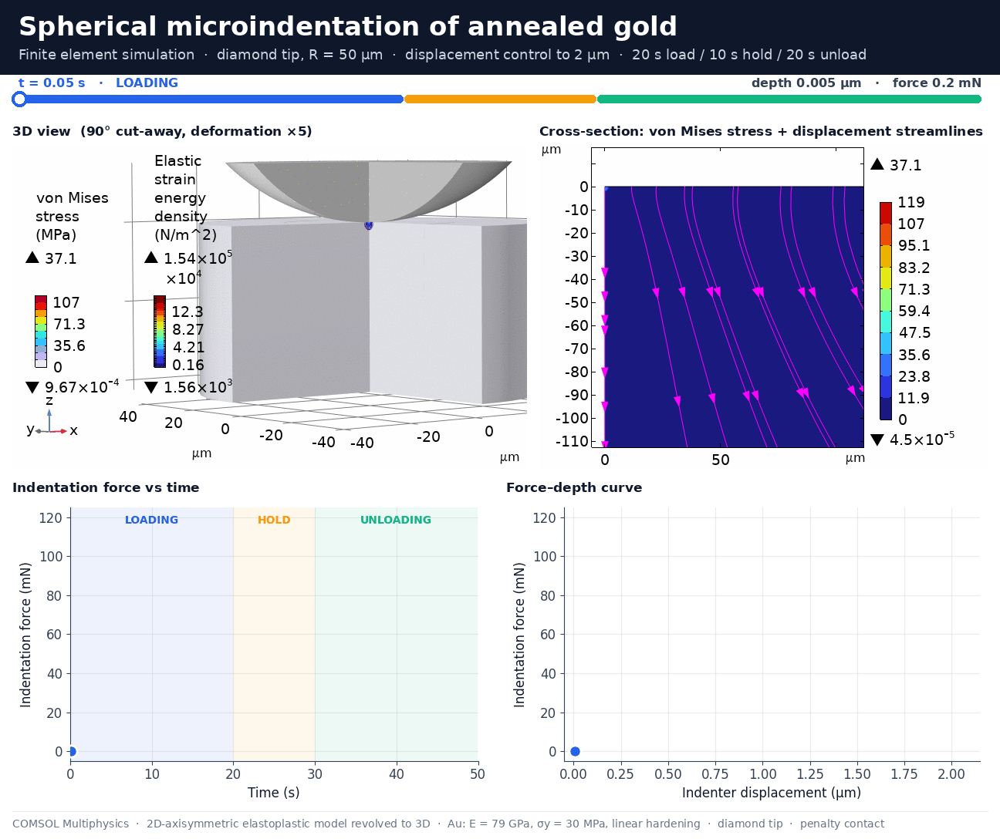

# Spherical Microindentation of Annealed Gold: COMSOL Finite Element Model




A finite element model of an instrumented spherical microindentation test on annealed pure gold. A diamond tip (R = 50 µm) is pressed 2 µm into the sample, held, and withdrawn back to its initial position. The model resolves the elastoplastic deformation under the tip, the force–depth response, the residual imprint and the residual stress field. It is solved as a 2D axisymmetric problem and revolved to 3D for visualization.

## Repository contents

| File | Description |
|---|---|
| `Micro_Indentation_Au.mph` | COMSOL model file (6.3), saved without solution |
| `Microindentation_Axisym.java` | Model file for Java that builds the complete model from scratch |
| `microindentation_gold.gif` | Animation of the full test: 3D view, cross-section, force–time and force–depth curves |

## Model overview

| Aspect | Setting |
|---|---|
| Geometry | 2D axisymmetric. Sample 300 µm (radius) × 300 µm (thickness); spherical indenter cap, R = 50 µm |
| Sample | Annealed Au, linear elastic + von Mises plasticity with linear isotropic hardening |
| Indenter | Diamond, linear elastic |
| Contact | Frictionless, penalty method; source = indenter surface, destination = sample surface |
| Boundary conditions | Sample bottom fixed; symmetry axis at r = 0; indenter driven through a load frame on its top face |
| Loading | Quasistatic load – hold – unload, 20 s / 10 s / 20 s, following the sequence of instrumented indentation testing [9] |
| Control | Displacement control to 2 µm (default) or force control to `F_max` |
| Kinematics | Geometric nonlinearity (enforced by contact) |
| Mesh | Mapped quadrilaterals (≈0.47 µm) in a 21 × 21 µm zone under the tip, graded triangles elsewhere; quadratic serendipity elements |
| Solver | Time dependent, BDF, strict time stepping, fully coupled Newton with damping |

### Control modes

The parameter `disp_ctrl` switches the test mode; no other change is needed.

| `disp_ctrl` | Mode | Program |
|---|---|---|
| `1` | Displacement control | depth 0 → `h_max` → hold → 0 |
| `0` | Force control | force 0 → `F_max` → hold → 0 |

The indenter top is connected to a load frame through a boundary load:

- **Displacement control.** A stiff spring (`k_stiff` ≈ 2.2 × 10⁹ N/m, about 1000× the contact stiffness) pulls the indenter top to the commanded depth. The positioning error at peak load is below 0.1 nm.
- **Force control.** The commanded force is applied directly. A weak stabilizing spring (`k_soft` = 500 N/m, about 1 % of the peak load at 2 µm) keeps the indenter from floating when it is not in contact.

The output `F_ind` is the force actually transmitted to the sample in both modes. `h_ind` is the indenter displacement from its initial position. The load program is defined by the variables `prog`, `delta_cmd` and `F_cmd` under *Component 1 > Definitions*.

## Material parameters

All values are rough estimates from published data for annealed, high-purity (≥ 99.99 %) bulk gold and standard indenter data.

| Parameter | Value | Source | Estimated accuracy |
|---|---|---|---|
| Young's modulus, Au | 79 GPa | [1], [2] (78.5 GPa) | ±5 % (74–81 GPa reported [1], [2], [5]) |
| Poisson's ratio, Au | 0.42 | [2] | ±0.02 |
| Density, Au | 19 300 kg/m³ | [1], [2] | < 1 % |
| Initial yield stress, Au | 30 MPa | [3] | ±30 %, strongly dependent on annealing and grain size |
| Isotropic tangent modulus, Au | 0.4 GPa | derived from [1] | ±50 % (see below) |
| Kinematic tangent modulus, Au | 0.4 GPa | assumed equal to the isotropic value | used only with kinematic hardening (inactive by default) |
| Young's modulus, diamond | 1141 GPa | [6] | standard value |
| Poisson's ratio, diamond | 0.07 | [6] | standard value |
| Density, diamond | 3515 kg/m³ | standard value | no influence on quasistatic results |

**Hardening fit.** Annealed gold reaches an ultimate tensile strength of about 124 MPa at about 45 % elongation [1]. Converting to true stress and true strain (≈180 MPa at ε ≈ 0.37) and fitting a straight line from the 30 MPa yield point gives a tangent modulus of about 0.4 GPa. Real gold hardens nonlinearly, steeper at small strains, so this bilinear fit is the least certain input of the model.

**Bulk versus films.** Thin and evaporated gold films are far stronger than annealed bulk gold; evaporated films have shown yield strengths around 270 MPa [4]. These parameters apply to annealed bulk material only.

## Results

Default case: displacement control, `h_max` = 2 µm.

| Quantity | Value |
|---|---|
| Peak indentation force | ≈ 113 mN at 2.00 µm |
| Loading curve | Nearly linear in depth (≈ 56 mN/µm) |
| Elastic recovery on unloading | < 50 nm: contact is lost within the first unloading output step |
| Residual imprint depth | ≈ 1.95 µm, i.e. almost the full 2 µm depth is permanent |
| Maximum von Mises stress during the test | ≈ 119 MPa |
| Maximum residual von Mises stress after unloading | ≈ 59 MPa |

### Plausibility checks

- **Mean contact pressure.** With a contact radius a ≈ √(2Rh) ≈ 14 µm, the mean pressure at peak load is about 180 MPa. That corresponds to roughly 18 HV, compared with 20–30 HV measured for annealed gold [1], [2], [3].
- **Constraint factor.** At Tabor's representative strain 0.2·a/R ≈ 0.057 [7], the bilinear model gives a flow stress of about 53 MPa. The ratio of mean pressure to flow stress is then about 3.4, close to the classical fully plastic value of about 3 [7].
- **Elastic recovery.** With the reduced modulus Eᵣ ≈ 88 GPa and unloading stiffness S ≈ 2Eᵣa ≈ 2.5 mN/nm, the Oliver–Pharr estimate of elastic recovery is 0.75·P/S ≈ 35 nm [6]. This is consistent with the simulated loss of contact within the first 50 nm of unloading.
- **Linear loading curve.** A nearly linear force–depth relation is expected for fully plastic spherical contact on a weakly hardening material: the mean pressure stays almost constant while the contact area grows linearly with depth [7], [8].

## How to run

### Option A: open the model file

Open `Micro_Indentation_Au.mph` in COMSOL 6.3 or newer and run *Study 1 > Compute*. The file is saved without a solution to keep it small.

### Option B: build from the Java file

The Java file is not tied to the COMSOL version that saved it, unlike the `.mph`. Compile it with the `comsolcompile` of your own installation.

Windows (PowerShell; note the `&`):

```powershell
& "C:\Program Files\COMSOL\COMSOL63\Multiphysics\bin\win64\comsolcompile.exe" .\Microindentation_Axisym.java
```

Linux / macOS:

```bash
comsol compile Microindentation_Axisym.java
```

Then either open `Microindentation_Axisym.class` in COMSOL (*File > Open*) and save the model as `.mph`, or build it in batch mode:

```powershell
& "C:\Program Files\COMSOL\COMSOL63\Multiphysics\bin\win64\comsolbatch.exe" -inputfile "$PWD\Microindentation_Axisym.class" -outputfile "$PWD\Micro_Indentation_Au.mph"
```

### Requirements

- COMSOL Multiphysics 6.3: the `.mph` opens in 6.3 or newer. The Java file was developed with 6.3; newer versions should build it, older versions may lack some settings.
- Structural Mechanics Module
- Nonlinear Structural Materials Module (plasticity) [10]

## Main parameters

| Parameter | Default | Meaning |
|---|---|---|
| `disp_ctrl` | 1 | 1 = displacement control, 0 = force control |
| `h_max` | 2 µm | Maximum depth (displacement control) |
| `F_max` | 100 mN | Maximum force (force control) |
| `t_load`, `t_hold`, `t_unload` | 20 s, 10 s, 20 s | Load program |
| `R_ind` | 50 µm | Tip radius |
| `W_s`, `H_s` | 300 µm | Sample radius and thickness |
| `sigy_s`, `Et_s` | 30 MPa, 0.4 GPa | Yield stress and tangent modulus of the sample |
| `E_ind`, `nu_ind` | 1141 GPa, 0.07 | Indenter elastic constants |

The mesh refinement zone scales automatically with the estimated contact radius `a_est = sqrt(2*R_ind*h_max)`.

## Outputs in the model

- Force–depth curve, depth vs time, force vs time
- Surface profile after unloading (residual imprint)
- 2D von Mises stress (with displacement streamlines) and equivalent plastic strain
- 3D revolved views with a 90° cut-away: von Mises stress at maximum load, residual von Mises stress, equivalent plastic strain, whole sample
- Animation of the full test (*Results > Export > Animation*), exportable as GIF or MP4

## Assumptions and limitations

- **Rate-independent plasticity.** Loading rate and hold time do not affect the result. Annealed gold creeps at room temperature, so a real test would show force relaxation (displacement control) or depth creep (force control) during the hold.
- **Bilinear hardening.** See the hardening fit above; a measured flow curve should replace it for quantitative work.
- **Homogeneous, isotropic continuum.** No grain structure, crystal plasticity or indentation size effect.
- **Frictionless contact and an ideal spherical tip.** No tip defects or surface roughness.
- **Axisymmetry.** Valid for spherical and conical tips. A Berkovich tip requires a 3D model or the equivalent 70.3° cone.
- **Mesh.** About 30 elements span the contact radius. A mesh convergence study is recommended before quantitative use.

## Notes on the animation

- 3D views use a deformation scale factor of 5 so the 2 µm imprint is visible.
- The force curves in the animation were re-plotted from the exported COMSOL animation frames (reading accuracy about ±0.5 mN). The peak value was clipped by the axis limit of the original export and estimated at ≈ 113 mN.
- The very first output step (t = 0) contains a solver initialization artifact in the force and is omitted from the animation.

## References

1. SubsTech (Substances & Technologies), *Gold*: properties of pure gold, annealed. https://www.substech.com/dokuwiki/doku.php?id=gold
2. RS Components, *Material Properties for Precious Metals*: datasheet for 99.99 % gold wire, annealed (soft) and hard. https://docs.rs-online.com/b526/A700000014144115.pdf
3. Metallographic.com, *Pure Gold*: material data. https://metallographic.com/materials/pure-gold
4. *Monotonic and fatigue testing of spring-bridged freestanding microbeams: application for MEMS*, DTIP 2007, arXiv:0802.3083. https://arxiv.org/abs/0802.3083
5. The Engineering ToolBox, *Young's Modulus of Elasticity – Values for Common Materials*. https://www.engineeringtoolbox.com/young-modulus-d_417.html
6. W. C. Oliver, G. M. Pharr, *An improved technique for determining hardness and elastic modulus using load and displacement sensing indentation experiments*, J. Mater. Res. 7 (1992) 1564–1583.
7. D. Tabor, *The Hardness of Metals*, Oxford University Press, 1951.
8. K. L. Johnson, *Contact Mechanics*, Cambridge University Press, 1985.
9. ISO 14577-1:2015, *Metallic materials — Instrumented indentation test for hardness and materials parameters — Part 1: Test method*.
10. COMSOL Multiphysics 6.3, *Structural Mechanics Module User's Guide* and *Nonlinear Structural Materials Module User's Guide*.
